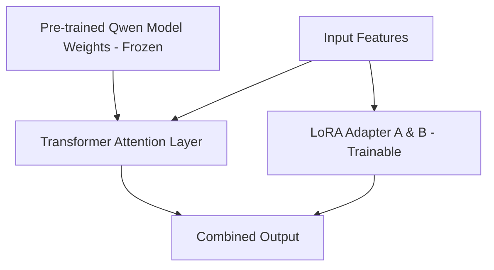

# LoRA Fine-Tuning with Qwen Model

This project demonstrates parameter-efficient fine-tuning using Low-Rank Adaptation (LoRA) on the Qwen model family.

## 📝 Description

LoRA freezes the pre-trained model weights and injects trainable rank decomposition matrices into each layer of the Transformer architecture, greatly reducing the number of trainable parameters for downstream tasks. This cookbook provides a step-by-step guide to setting up and training a Qwen model using LoRA.

---

## 🏗️ Architecture / Workflow



1. **Initialize Pre-trained Model**: Load the base Qwen model in half-precision (FP16/BF16).
2. **Apply LoRA Adapter**: Inject low-rank matrices (`r=8`, `alpha=16`) targeted at attention projection weights (`q_proj`, `v_proj`).
3. **Supervised Fine-Tuning**: Train exclusively on adapter parameters using the target dataset.
4. **Weights Merger**: (Optional) Merge LoRA weights back into the base model weights for production deployment.

---

## 📋 Requirements

Ensure the following dependencies are installed:

- Python 3.10+
- PyTorch (with CUDA support)
- Transformers
- PEFT (Parameter-Efficient Fine-Tuning)
- Accelerate
- Datasets

Install requirements via pip:
```bash
pip install torch transformers peft accelerate datasets
```

---

## 🚀 Execution & Usage

To execute the fine-tuning process, open the Jupyter Notebook and run all cells:

```bash
jupyter notebook LORA_WITH_QWENN_MODEL.ipynb
```
