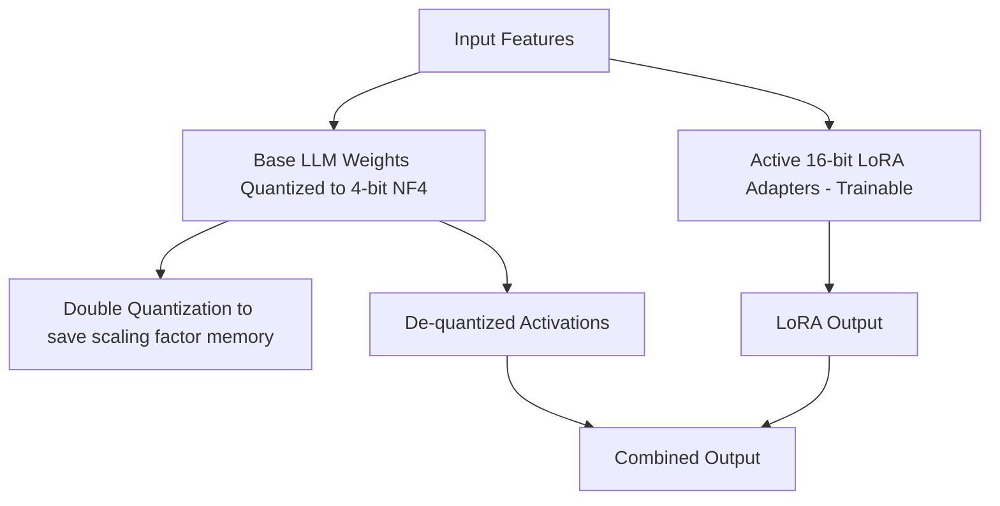

# QLoRA Fine-Tuning

This project implements Quantized Low-Rank Adaptation (QLoRA) to fine-tune Large Language Models efficiently on consumer-grade hardware.

## 📝 Description

QLoRA backpropagates gradients through a frozen, 4-bit quantized pretrained language model into Low-Rank Adapters (LoRA). It introduces innovations like NF4 (NormalFloat 4) data type, Double Quantization, and Paged Optimizers to save memory without sacrificing performance.

---

## 🏗️ Architecture / Workflow



1. **Quantized Load**: Load the base model in 4-bit NormalFloat (NF4) with Double Quantization enabled.
2. **Setup PEFT Config**: Define the LoRA parameters (target modules, rank, dropout) mapping to the quantized model.
3. **Paged Optimizers**: Configure page-to-page memory transfers to handle memory spikes gracefully during backpropagation.
4. **Fine-Tuning**: Execute training on the target task dataset.

---

## 📋 Requirements

Ensure the following dependencies are installed:

- Python 3.10+
- PyTorch (with CUDA support)
- Transformers
- PEFT
- BitsAndBytes (for 4-bit quantization)
- Accelerate
- Datasets

Install requirements via pip:
```bash
pip install torch transformers peft bitsandbytes accelerate datasets
```

---

## 🚀 Execution & Usage

To execute the fine-tuning process, open the Jupyter Notebook and run all cells:

```bash
jupyter notebook QLora_FineTuning.ipynb
```
